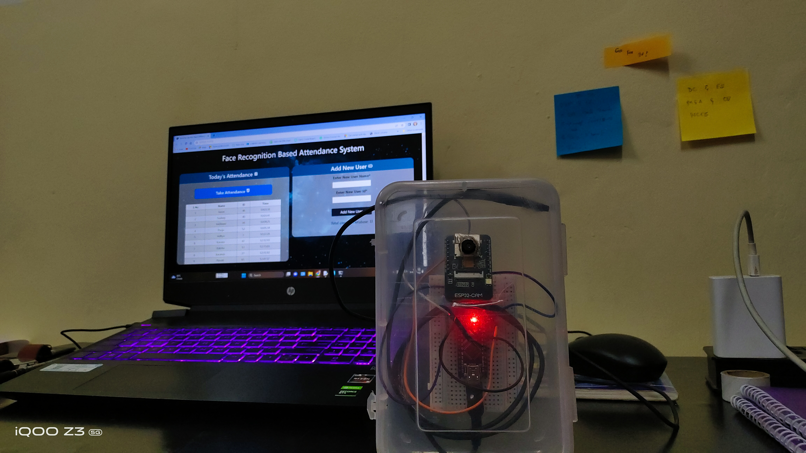
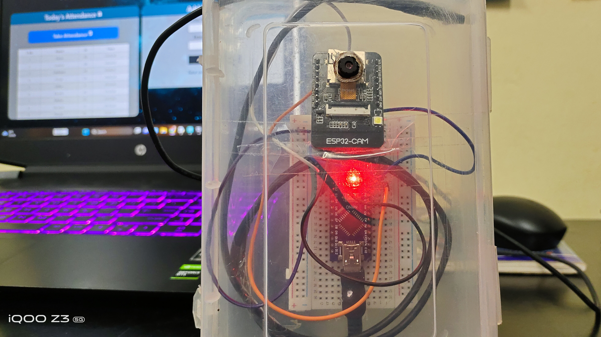
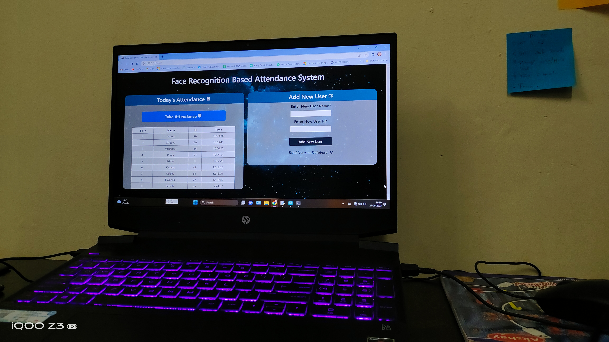
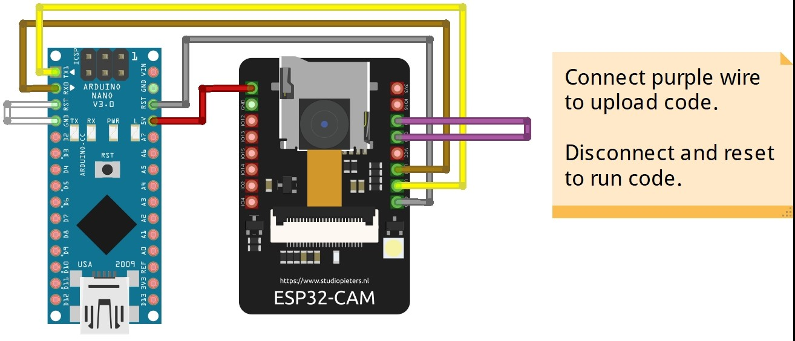

  <h1>Face Recognition-Based Attendance System Using ESP32-CAM</h1>

Welcome to the Face Recognition-Based Attendance System project, where we leverage the power of ESP32-CAM and Arduino Nano to create an innovative attendance management solution.

## Project Overview

This project combines the versatility of the ESP32-CAM module and the processing capabilities of Arduino Nano to develop an intelligent attendance system. By utilizing facial recognition technology, it simplifies the attendance tracking process, making it efficient and secure.

## Key Features

- Utilizes ESP32-CAM and Arduino Nano for seamless integration and robust performance.
- Streamlines attendance management with facial recognition, eliminating the need for traditional methods.
- Offers real-time attendance tracking and reporting, enhancing data accuracy and accessibility.
- Provides an intuitive and user-friendly interface for administrators and users.
- Promotes security and accountability by accurately identifying and recording attendance.
- Customizable and adaptable to various settings, from classrooms to workplaces.
- Supports the growth of a paperless and eco-friendly attendance management system.

## Code Credits

- [GitHub Repository](https://github.com/sharmaji27)

## Usage

In this project, you can connect any webcam by changing the index number of the camera in the HTTP request to access the video feed from the webcam. We have utilized the ESP32-CAM as a webcam. Both the system and the ESP32-CAM should be connected to the same Wi-Fi network to host the server and execute the project.

## Project Snapshots

## Home Page

## Circuit Diagram

